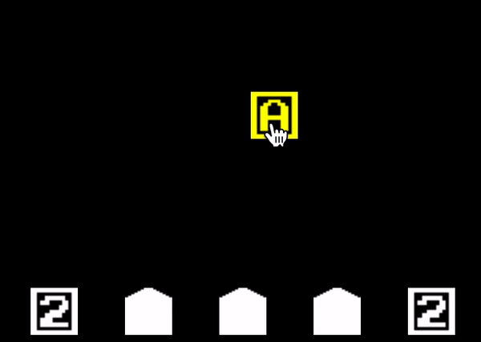
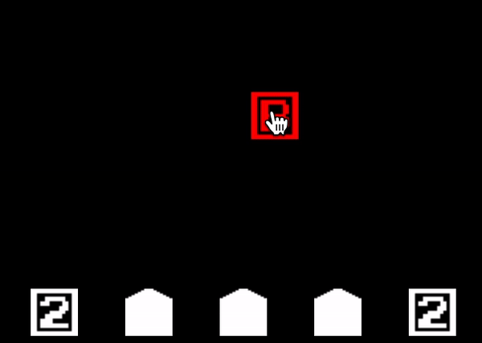
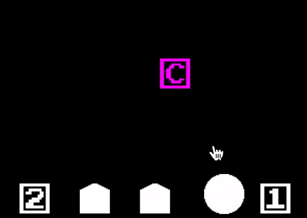
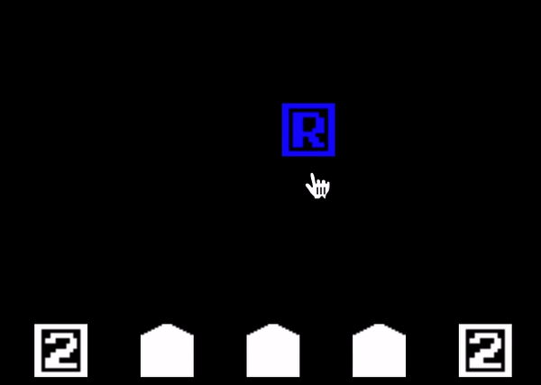
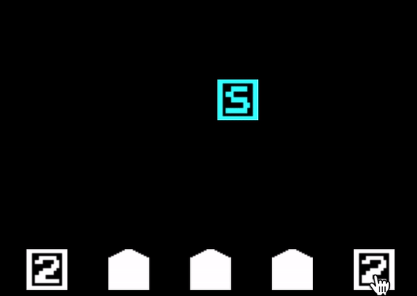
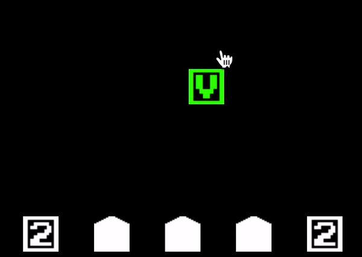
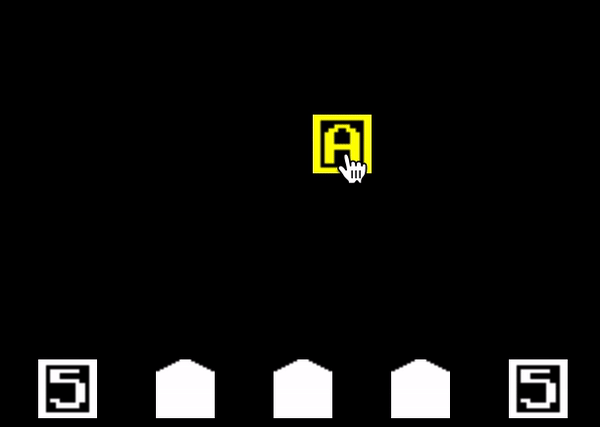
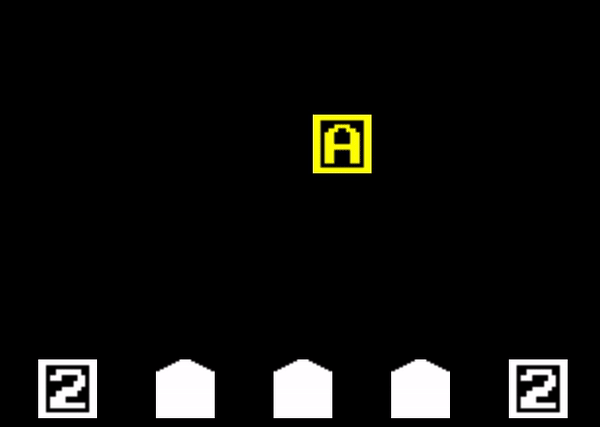
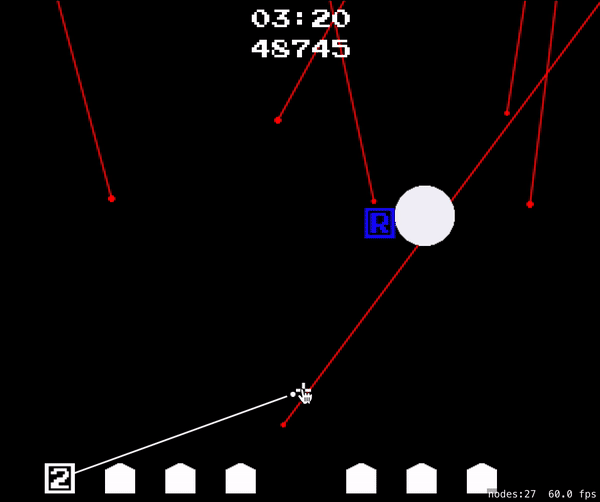
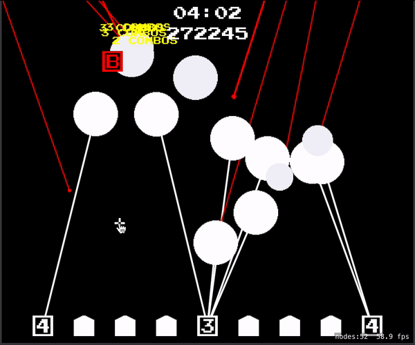

# 🚀 Missile Commander
  
Missile Commander is a retro style shooting game inspired by Missile Command(1979). I used Spritekit to implement all the functionalities, [pixilart](pixilart.com) to draw sprite textures, [Bfxr](https://www.bfxr.net/) to mix the sound effects. 
I made this game because I think making a game with a new language is one of the best way to learn that language.

## Goal
The goal of this game is to survive from enemy attack and earn as many score as possible.
## Buildings

Silo can shoot missile to protect your city and silo itself. You can have 3 silos. If all of your silos destroyed, you lose the game.

 
You should protect city from enemy attack. You can have 6 cities. If all of your cities destroyed, you lose the game.

## Enemy

Enemy warheads will appear and falling down to destroy all of your buildings. You should shoot the counter projectile to destroy warhead before it reach to the target.

Tzar is the biggest enemy warhead. It's blast range is so big that you have be careful.

 Bomber will fly by and drop bunch of warheads all over your city. So it might be tricky to dealing with it. 

## Play
  
You can shoot counter projectile by clicking on the game scene. Missile will be launched from the closest silo to the target point. If silo is out of missile, It takes time to reload. 

## Items
Items will be appeared on GameScene to help you.   
  
A - Ammunition. It will increase your silo's maximum missile capacity and reload it.  
  
B - Blast Range. It will increase your projectile's explosion blast range.  
  
C - City. It will rebuild the city if available.  
  
D - Duration, It will increase the duration of all explosions.  
  
R - Reload Time. It will decrease the time to reload projectile.  
  
S - Silo. It will rebuild the silo if available.  
  
V - Velocity. It will increase the velocity of your projectiles.  
  
If your ability is already at max level, you will get + 10000 score instead.  
  
Item will be mutated every 5 seconds, so you can wait for what you want. But, it will be disappear after mutating 3 times so you have to be careful.

## Difficulty
   
Enemy attacks will be getting stronger every 30 seconds. Actually, difficulty of this game is designed to eliminate you in less than 3 minutes. But if you managed to survive from 3 minutes and 30 seconds of intense enemy attack, there will be "Hell" difficulty waiting for you. I'm pretty sure that you CAN NOT survive from it.

## Combo system
 
There is a chaining explosion combo system in this game. If you terminate the enemy attack, than it will explode too. So you can chaining these explosions. Combo will be multiply your score. So it really helps you to earn more score.